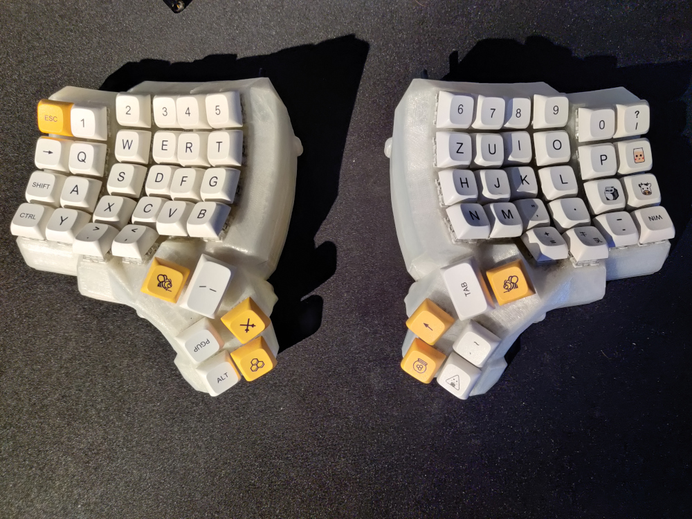

# Mechanical Keyboards

I've 3D printed and hand soldered a Dactyl Manuform 5x6 by myself and want to share the configs.
The first attempt was using [QMK](https://qmk.fm/) which ist great (sure it is, it has RGB). Then I wanted to try Bluetooth via [ZMK](https://zmk.dev/), which is now my daily driver.

In a nutshell I can tell: If you're ok with a permanent cable attached go with QMK. If you dislike that idea or want to use it e.g. with your mobile phone or whatever go with ZMK.
Both have their pros and cons. See the [ZMK README.md](zmk-config-dactyl_manuform/README.md#dual-boot) e.g. for some dual boot specialties.

That's a picture of the current state:

In [media](media) you can find few more impressions of both versions.
