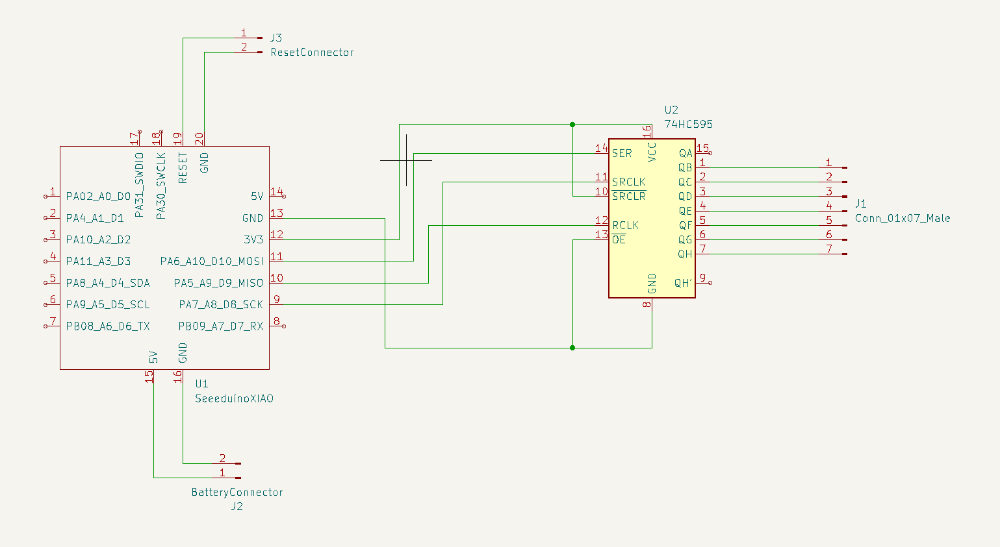
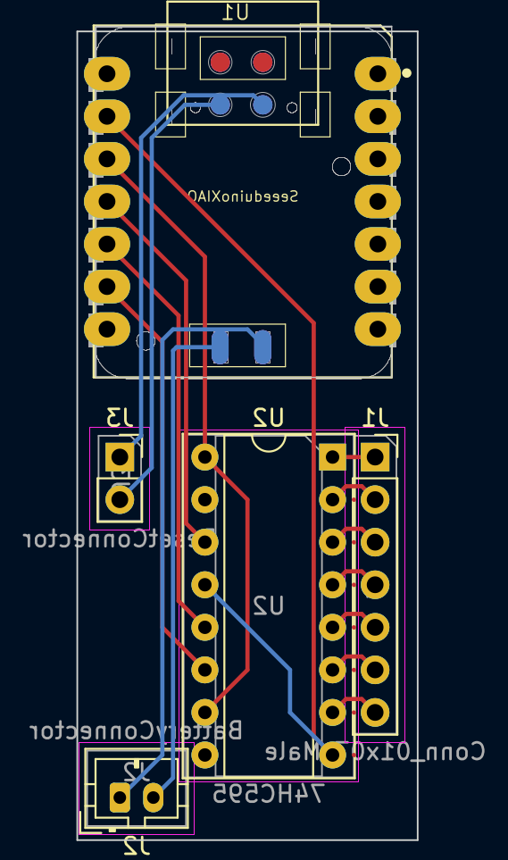

# ZMK Config Dactyl Manuform via Seeed XIAO BLE

This config is used to run a Dactyl Manuform 5x6 split keyboard on two Seeed XIAO BLE controllers with 595 shift registers for pin extension.

## Install

Do all the steps described here (install CMake, Python, DeviceTree compiler aka Ninja, west, Zephyr SDK, ...):
https://zmk.dev/docs/development/setup

The Build Script requires the ZMK installation to be at `$HOME/dev/repos/zmk`.

## Update

To update ZMK follow e.g. these steps: https://zmk.dev/blog/2024/02/09/zephyr-3-5#local-host-development

    git pull        # from inside cloned zmk repo (https://github.com/zmkfirmware/zmk.git)
    pip3 install --user --upgrade west
    west update     # from inside cloned zmk repo

## Build and Flash

Run `build.sh` to build. Use parameter `-c` to clean up build directory beforehand.
Parameter `-f` flashes the uf2 file to the XIAO drive. With parameter `-r` the reset image is build.

    build.sh

    [no param]  Build left and right binary
    -c          Clean build directory. Cannot be used with -f.
    -f (left|right|reset)
                Flashes the selected binary to the controller
    -r          Build reset binary

## Soldering

This is the way the XIAO is connected to the 595:

I soldered all components to a perfboard. The following image shows the mirrored PCB design. Since the footprint is not exactly the BLE type the middle pads are not correctly placed.

## Troubleshoot

### Dual boot / GRUB / LUKS / BIOS / UEFI

Keep in mind that the bluetooth stack is not available at boot. So if you want to
- select OS in GRUB
- decrypt LUKS
- enter BIOS/UEFI

you need to connect a cable every time. To keep it acceptable I'm using a magnetic USB-C cable with a magnet dongle. Just grab a cable that also has data lines not just power lines.

### Dual boot

If there are two OS installed on your PC you need to do some extra steps, described here:
https://wiki.archlinux.org/title/bluetooth#Dual_boot_pairing

What's the issue? Once paired in one OS you cannot establish a connection via the second OS, since the same key is used and every OS handles its own key.
Even using another bluetooth profile doesn't fix the problem. What makes me wonder, since using another profile on a second device works out of the box. Somehow the devices MAC is shared maybe ...

### Bluetooth error

    Connection Failed: le-connection-abort-by-local

Solution 1: Clear all bluetooth profiles, remove known device in OS bluetooth settings, try again.

Solution 2: Flash Settings Reset image to both halves: https://zmk.dev/docs/troubleshooting#split-keyboard-halves-unable-to-pair
